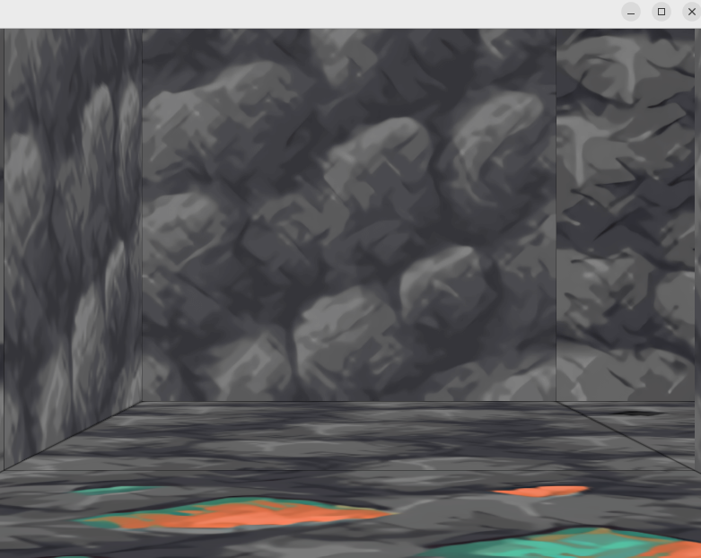
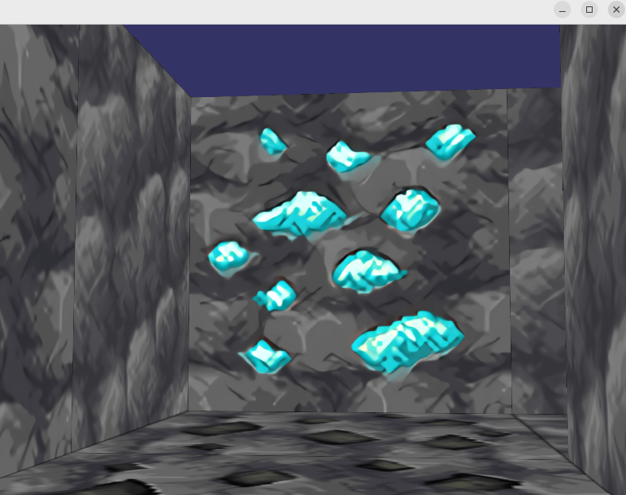
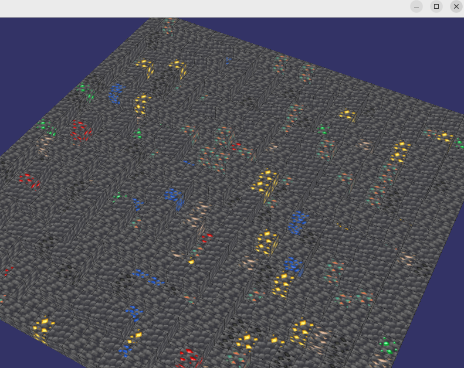

# Maze Runner

Maze Runner is a simple maze exploration application built using OpenSceneGraph (OSG) in C++. The application generates a random maze using a depth-first search algorithm and allows the user to navigate through it using a first-person camera controller.

The key is to find the diamonds in the maze.

## Table of Contents

- [Maze Runner](#maze-runner)
  - [Table of Contents](#table-of-contents)
  - [Dependencies](#dependencies)
  - [Building](#building)
  - [Usage](#usage)
  - [Controls](#controls)
  - [Screenshots](#screenshots)

## Dependencies

- OpenSceneGraph (OSG)

## Building

To build the Maze Explorer application, use the following command:

```bash
g++ -o osg Main.cpp MazeGenerator.cpp CameraController.cpp -losgViewer -losgDB -losg -losgGA -losgUtil -lOpenThreads
```

## Usage

Run the compiled executable:

```bash
./osg [MAZE_SIZE]
```

- `MAZE_SIZE` (optional): Specifies the size of the maze. The default size is 25. The minimum allowed size is 5, and the maximum is 50. If an even size is provided, it will be incremented by 1 in order to preserve the outer walls.

## Controls

- Use the `WSAD` keys to navigate through the maze.
- Use `EQ` keys to rotate camera to the left/right.
- Use `MOUSE_LMB` and drag to rotate camera.
- Press the `ESC` key to exit the application.

## Screenshots



